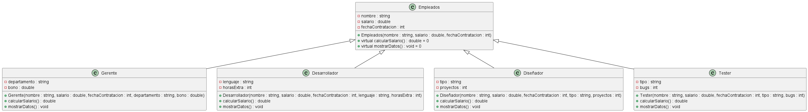

# Proyecto de semana 1

## Problema

Crear una jerarquía de clases para representar diferentes tipos de empleados (gerentes desarrolladores, diseñadores, etc.). La clase base Empleado debe tener atributos comunes (nombre, salario, fecha de contratación) y un método virtual calcular Salario).
Implementar clases derivadas para cada tipo de empleado, sobrescribiendo calcular Salario) según las reglas específicas de cada tipo (por ejemplo, los gerentes pueden tener bonos adicionales).
Crear un arreglo de punteros a Empleado y llenarlo con objetos de diferentes boos Demostrar el polimorfismo al calcular los salarios.

## Description del proyecto

El proyecto se basa en la creación de una jerarquía de clases para representar diferentes tipos de empleados, en este caso se tienen los siguientes tipos de empleados:

- Gerente
- Desarrollador
- Diseñador
- Tester

Cada uno de estos empleados tiene atributos comunes como nombre, salario y fecha de contratación, además de un método virtual `calcularSalario()` que se sobreescribe en cada clase derivada para calcular el salario de cada empleado.

## Diagrama de clases

## Diagrama de secuencia

